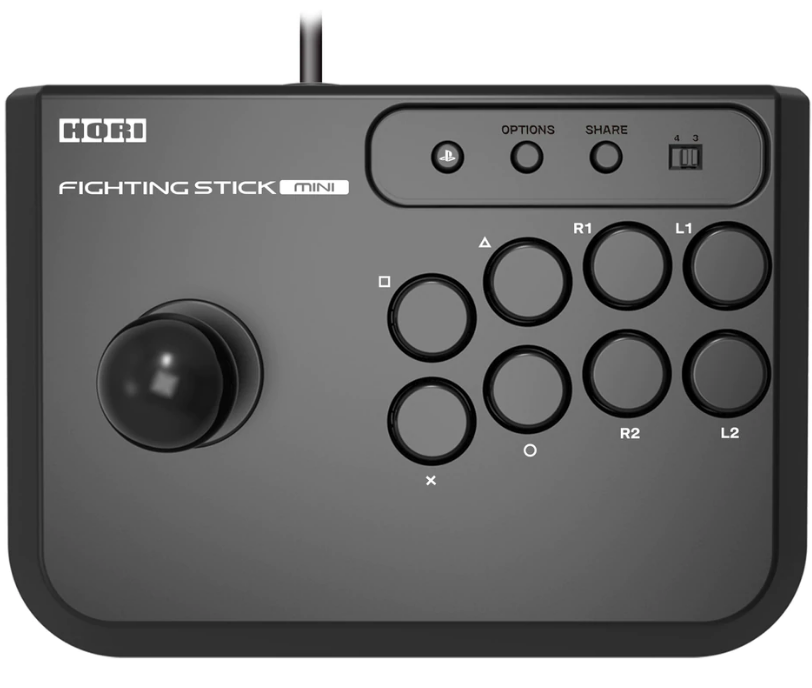
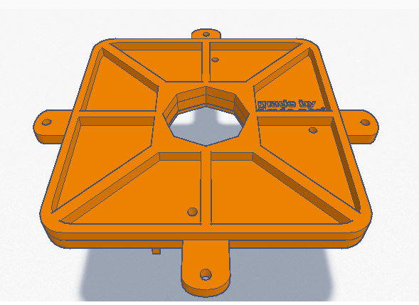
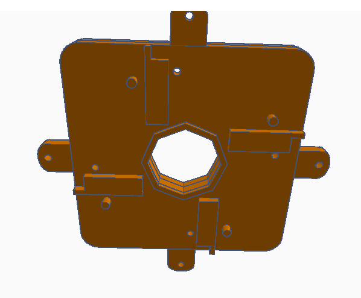
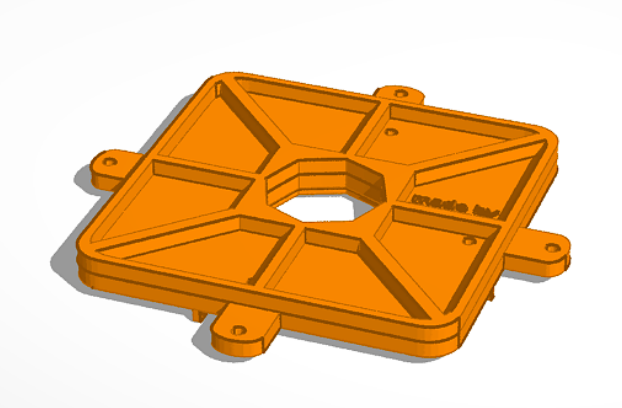

# Hori Fighting Stick MINI 4 for PS4 8 way gate

This project is a homebrew hardware designed with [ThinkerCAD](https://www.tinkercad.com) and [Inkscape](https://inkscape.org/) to replace the original Hori 4 way gate for a 8 way gate.

This should be printed by a 3d printer and I'll support both **STL** and **OBJ** formats.

I tested this with my own stick and it seems that it worked well.

## Screenshots from the files:

**Use this project at your own risk!**

PT_PT ---

Este projeto é um *homebrew* desenhado com o [ThinkerCAD](https://www.tinkercad.com) e o [Inkscape](https://inkscape.org/) para substituir o *gate* original de 4 via do Hori por um de 8 vias.

Para usar este projeto você deve imprimir um dos arquivos disponíveis em uma impressora 3d. Quaisquer atualizações suportarão os formatos **STL** e **OBJ**.

Seus Shoryuken agradecem. :-)

Eu testei este gate no meu controle e ele funcionou corretamente.

**Use este projeto sob seu próprio risco!**

 Este obra está licenciado com uma Licença <a rel="license" href="http://creativecommons.org/licenses/by-sa/4.0/">Creative Commons Atribuição-CompartilhaIgual 4.0 Internacional</a>.
